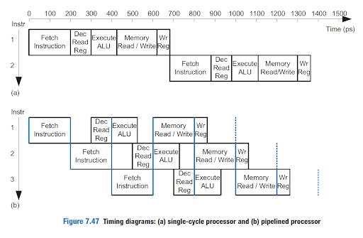
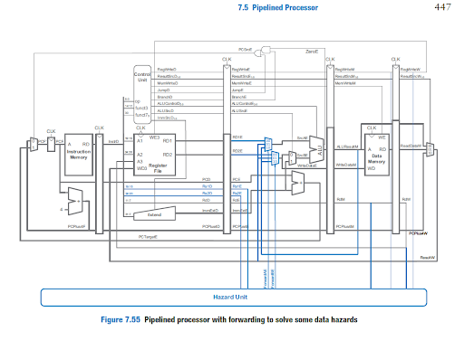
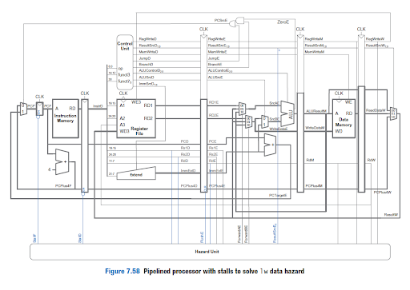

# Pipelined_RISC-V_CPU

## Introduction

Our goal for this project is to implement a pipelined CPU in SystemVerilog.

## Usage

You can write assembly instructions in any of the .s files in the asm directory. To run a simulation, use the make file to execute the appropriate commands.

Example:

itypes.s contains I type instructions.

Run simulation:

make test_rv32i_itypes

Visualize output in gtkwave:

make waves_rv23i_system

## What is a pipelined CPU?

A pipelined CPU is based on the single-cycle processor and dividing it into 5 stages, allowing 5 instructions to be run at the same, each at a different stage. This theoretically makes the cpu 5 times faster. The following are the 5 stages:

<ol>
<li>Fetch - processor reads the instruction from instruction memory</li>
<li>Decode - processor reads the source operands from the register file and decodes the instruction to produce the control signals
</li>

<li>Execute - processor performs a computation with the ALU
</li>

<li>Memory - the processor reads or writes data memory, if applicable
</li>

<li>Writeback - the processor writes the result to the register file, if applicable
</li>
</ol>

Here is an image representing the cycle times of a pipelined cpu.



## Hazards

A hazard occurs when an instruction depends on the output of an instruction that has not been completed. Hazards have two types. The first is a data hazard, which happens when an instruction reads a register that has not been written by some previous instruction. The second is a control hazard, which is if the decision to determine which instruction to fetch next has not been made when the fetch occurs. In other words, this occurs when a branch instruction has not been computed and the next instruction is fetched.

### Forwarding

Data Hazards can be solved using forwarding. The data that is needed during this register may be available in the internal buses before it is written to the register file, thus forwarding moves the data from the bus back to the Execute stage of the instruction that needs it. Thus, we can check if a source register that is in the Execute state matches a destination register in the Memory or Writeback stage, and if so forward the result.

Thus, with the new hardware that is being added for forwarding we have 3 cases. 

Case 1:
At the Execute stage if source register 1 or source register 2 matches the destination register in Memory, then forward the data from the Memory stage

Case 2: 
At the Execute if source register 1 or source register 2 matches the destination register in the Writeback stage then forward from the Writeback stage

Case 3: Read value from register file, which is usually the case.

For source register these cases can be represented with the following logic where ForwardAE is the input to a mux that selects the cases:

```
if ((Rs1E == RdM) & RegWriteM) & (Rs1E != 0) then
	ForwardAE = 10
else if ((Rs1E == RdW) & RegWriteW) & (Rs1E != 0) then
	ForwardAE = 01
else 
	ForwardAE = 00
```
### Stalling
There are some cases where forwarding will not resolve the data hazard. We can solve those cases with a Stall. A stall holds the operation until the necessary data is available

The stalling logic only applies during load word. Thus, ff source register 1 or source register 2 in the Decode stage is the same as the destination register in the execute stage and the Instricution is load word. This is represented by:
```
lwStall = ResultSrcE_0 & ((Rs1D == RdE) | (Rs2D == RdE))
stallF = stallD = FlushE = lwStall
```
### Flushing for Control Hazard

Control hazards can be solved by flushing, which clears the Decode and Execute registers for the instructions that should not have been computed. Flushing ensures that the instructions that are being executed but should be skipped because of a branch result, aren’t fully computed. This flush happens when the branch is taken in the execute stage.  This logic is represented by the expression
```
FlushD = PCSrcE
FlushE = lwStall | PCSrcE
```
## Hardware

<b>New Hardware</b>
<ul>
<li>4 registers between the 5 stages to be able to stall/forward states</li>
<li>Hazard unit</li>
<li>A few new control signals in control unit
</li>
</ul>

<b>New Hardware for Forwarding</b>
<ul>
<li>Depends on hazard unit
</li>
<li>Two forwarding multiplexers
</li>
</ul>

### Hazard Unit

We need to implement new hardware to handle these hazards. To support forwarding, the hazard detection unit receives the two source registers from the instruction in the Execute stage, Rs1E and Rs2E, and the destination registers from the instructions in the Memory and Writeback stages, RdM and RdW. It also receives the RegWrite signals from the Memory and Writeback stages (RegWriteM and RegWriteW) to know whether the destination register will actually be written (e.g., the sw and beq instructions do not write results to the register file and, hence, do not have their results forwarded). We can see the new additions for forwarding below:



In brief, these additions dictate that the Hazard Unit should forward from a stage if that stage will write a destination register and the destination register matches the source register. Note that If both the Memory and Writeback stages contain matching destination registers, then the Memory stage should have priority because it contains the more recently executed instruction. The exact boolean expression for SrcAE (ForwardAE) and SrcBE (ForwardBE) will be covered later on. 

To support stalling, we need to understand the criteria behind a stall. In order for the Hazard Unit to stall the pipeline, the following conditions must be met:

<ol>
<li>A load word is in the Execute stage (indicated by ResultSrcE0 = 1)
</li>
<li>The load’s destination register (RdE) matches Rs1D or Rs2D, the source operands of the instruction in the Decode stage
</li>
</ol>

Stalls are supported by adding enable inputs (EN) to the Fetch and Decode pipeline registers and a synchronous reset/clear (CLR) input to the Execute pipeline register. When a stall occurs the unit forces the decode and fetch stages’ registers to retain their values. It also flushes the execute stage to remove erroneous values. Below we can see the new hardware.



Finally, we need to support the branch misprediction penalty. Since if a branch is taken, we would need to stall 2 cycles, we try to predict what branch it will take. If we choose the wrong way, we need to flush two cycles and continue as if we had just waited for the instruction. Thus, we add a synchronous clear input (CLR) to the Decode pipeline register and add the FlushD output to the Hazard Unit. (When CLR = 1, the register contents are cleared, that is, become 0.) When a branch is taken (indicated by PCSrcE being 1), FlushD and FlushE must be asserted to flush the Decode and Execute pipeline registers. We can see the implementation of the hazard full unit below with the new additions highlighted.


